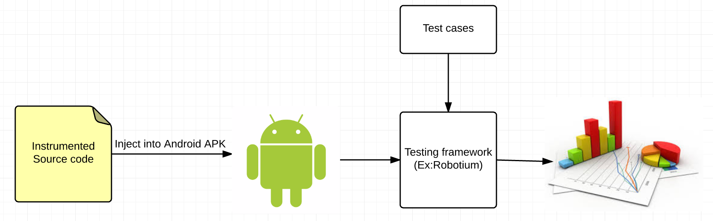

# SIS PhD Exercises.

### Ex1:


Prior work [1, 2, 3] showed how the following components are often significant power consumers in mobile applications:

• CPU consumers are used to represent CPU-intensive code segments such as calculations on sensor data.

• Memory consumers generate dynamically allocated memory

• Accelerometer consumers, which interact with system accelerometers and con- sume accelerometer data.

• GPS consumers interact with the device’s GPS receiver.

• Network consumers emulate application network interaction by periodically trans- mitting and receiving data.

• Screen drawing agents utilize graphics libraries, such as OpenGL, to emulate a graphics-intensive application.

I will make an assumption that the above components are the part that consume significant power in mobile application. Thus I will focus to detect which of the above components will consume significant power in a mobile app.

In general, given an application, we don't know exactly which one of these components will consume signficant power. Since we don't have the source code , but we can extract the APK file of any application from the Android phone. The APK is just the compiled set of Java byte code , image resources, config resources. In this case, we should only care about the Java byte code. Since Java byte code is the instruction set of the Java virtual machine  , in Android , it's Dalvik virtual machine , we can use ClassLoader, which is provided by the Java Platform to decompile the Java byte code and, we can put our pre-defined variables, statements into the decompiled code unify it in a new Java object (Instrumentation code) and transforme our new source code to a new APK. There are some existed tools that have developed by different research teams around the world , like Soot , GreenAndroid , etc

Based on those assumptions, my proposed solution will be :

-After extracted the APK, write instrumentation code to inject into APK. We can inject some instrumented code like write all of the method called into the log file , for example.

-Write test cases to run test on the APK (Ex: Robotium framework).

-The tests will be executed to get the trace (list of invoked methods). The results will be saved in files (one for each test), containing a list of the methods invoked, along with the number of times it was invoked, and also the execution time of the test.

-After all the tests executed , the framework would have generated a set of files as big as the number of tests. For convenience, the tests will be merged in one file to be read, parsed and the information extracted once.

–Classify the methods: At this point, the framework will get the values read from the file and classify them (and respective classes, packages and projects) according to the categories that described above.

–Generate the results: Use charts to generate a graphical representation of the source code components, giving them different colors according to its green-aware classification.

For a very generic case, an application will be implemented under the combination of different components, like Sensor, GPS , Network, etc. We can write the instrumentation code for all of these components to benchmark the app. 

For a specific case , like the indoor localization application in this exercise, the algorithms are based on collecting wifi signal and perform some calculation tasks. So the WifiManager components of Android should be the component we focus to write instrumentation code.

### This is the overview diagram of my proposed solution:


### Ex2 :

Base on the requirement , I will assume that the Android app will call WifiManager.startScan() periodically to scan wifi signal, which consume massive amount energy of the battery.

The steps will be :

-Use some APK Extractor to extract the APK file from the phone.

-Now I have the APK file, I will use Soot and Jimple to instrument the APK file.

-After finish instrumenting, a new APK file is conducted, with my new instrumenting code that have been injected into the APK via Soot and Jimple.

Pseudo-code to instrument the APK:
```
import java.util.ArrayList;
import java.util.Iterator;
import java.util.List;
import java.util.Map;

import soot.Body;
import soot.BodyTransformer;
import soot.BooleanType;
import soot.Local;
import soot.RefType;
import soot.Scene;
import soot.SootMethod;
import soot.Type;
import soot.Unit;
import soot.Value;
import soot.javaToJimple.LocalGenerator;
import soot.jimple.AssignStmt;
import soot.jimple.EqExpr;
import soot.jimple.IfStmt;
import soot.jimple.IntConstant;
import soot.jimple.InvokeStmt;
import soot.jimple.Jimple;
import soot.jimple.NopStmt;
import soot.jimple.StaticInvokeExpr;
import soot.jimple.StringConstant;
import soot.jimple.VirtualInvokeExpr;
import soot.util.Chain;

public class MyBodyTransformer extends BodyTransformer{

	@Override
	protected void internalTransform(Body body, String arg0, Map arg1) {
	
	        // Something like a Classloader , which will load and iterate through all java classes of the APK.
		if (body.getMethod().getDeclaringClass().getName().startsWith("de.ecspride")) {
			Iterator<Unit> i = body.getUnits().snapshotIterator();
			while (i.hasNext()) {
				Unit u = i.next();

				countNumberOfStartScanFromWifiManager(u, body);
			}
		}
	}

	private void countNumberOfStartScanFromWifiManager(Unit u, Body body){		
		if(u instanceof InvokeStmt){
			InvokeStmt invoke = (InvokeStmt)u;
			
			if(invoke.getInvokeExpr().getMethod().getSignature().equals("<android.net.wifi.WifiManager: boolean startScan()>")){
				Local phoneNumberLocal = (Local)phoneNumber;
				List<Unit> generated = new ArrayList<Unit>();
				
				//generate startsWith method
				VirtualInvokeExpr vinvokeExpr = generateStartsWithMethod(body, phoneNumberLocal);
				
				//generate assignment of local (boolean) with the startsWith method
				Type booleanType = BooleanType.v();
				Local localBoolean = generateNewLocal(body, booleanType);
				AssignStmt astmt = Jimple.v().newAssignStmt(localBoolean, vinvokeExpr);
				generated.add(astmt);
				
				//generate condition
				IntConstant zero = IntConstant.v(0);
				EqExpr equalExpr = Jimple.v().newEqExpr(localBoolean, zero);
				NopStmt nop = insertNopStmt(body, u);
				IfStmt ifStmt = Jimple.v().newIfStmt(equalExpr, nop);
				generated.add(ifStmt);
				
				body.getUnits().insertBefore(generated, u);
			}
				
		}
	}
	
	private VirtualInvokeExpr generateStartsWithMethod(Body body, Local phoneNumberLocal){
		SootMethod sm = Scene.v().getMethod("<java.lang.String: boolean startsWith(java.lang.String)>");
		
		
		Value value = StringConstant.v("0900");
		VirtualInvokeExpr vinvokeExpr = Jimple.v().newVirtualInvokeExpr(phoneNumberLocal, sm.makeRef(), value);
		return vinvokeExpr;
	}
	
	private Local generateNewLocal(Body body, Type type){
		LocalGenerator lg = new LocalGenerator(body);
		return lg.generateLocal(type);
	}	
	
	private NopStmt insertNopStmt(Body body, Unit u){
		NopStmt nop = Jimple.v().newNopStmt();
		body.getUnits().insertAfter(nop, u);
		return nop;
	}
}

```


1. C. Thompson, J. White, B. Dougherty, and D. Schmidt. Optimizing Mobile Application
Performance with Model-Driven Engineering. In Proceedings of the 7th IFIP Workshop on
Software Technologies for Future Embedded and Ubiquitous Systems, 2009.
2. H. Turner, J. White, C. Thompson, K. Zienkiewicz, S. Campbell, and D. Schmidt. Building Mobile Sensor Networks Using Smartphones and Web Services: Ramifications and Develop- ment Challenges. In Maria Manuela Cruz-Cunha and Fernando Moreira, editor, Handbook of Research on Mobility and Computing: Evolving Technologies and Ubiquitous Impacts.
IGI Global, Hershey, PA, USA, 2009.
3. J.White,S.Clarke,B.Dougherty,C.Thompson,andD.Schmidt.R&DChallengesandSo-
lutions for Mobile Cyber-Physical Applications and Supporting Internet Services. Springer
Journal of Internet Services and Applications, 1(1):45–56, 2010.

